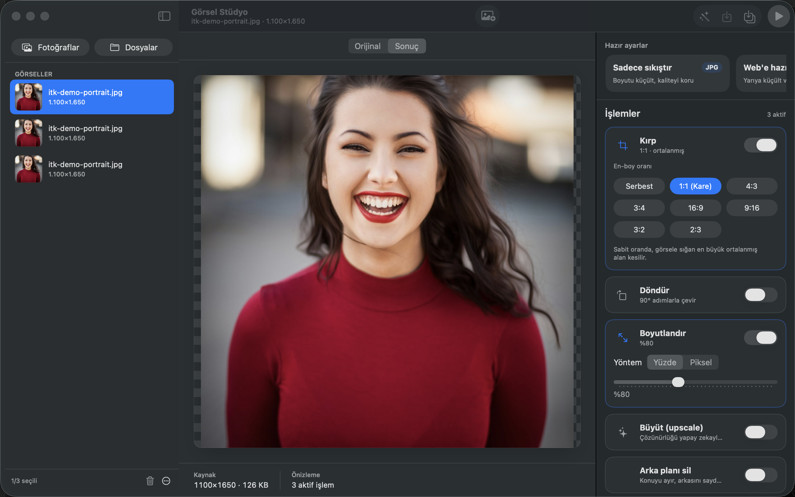
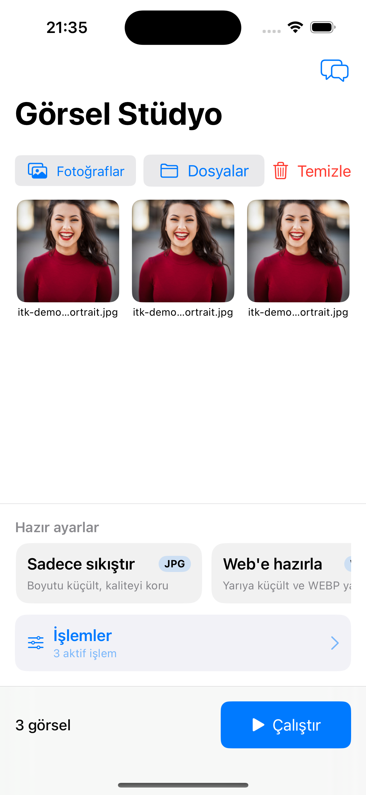
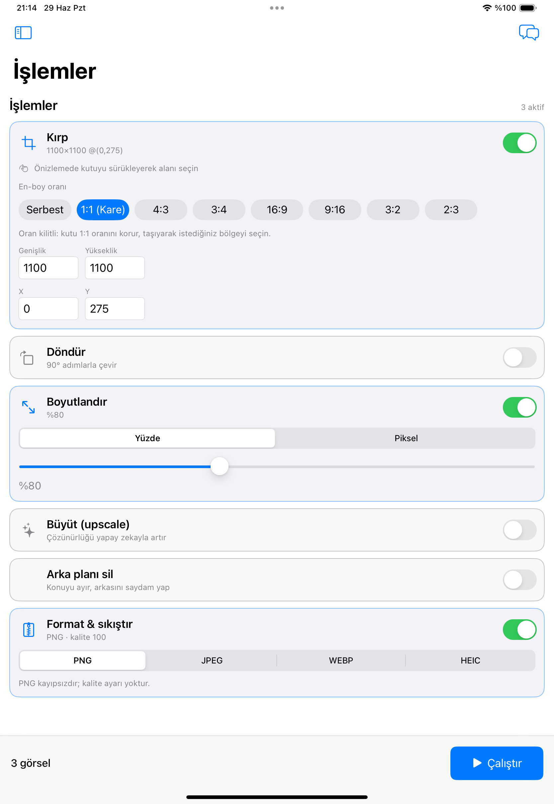

# Görsel Stüdyo

**Görsel Stüdyo**, macOS için tasarlanmış bir görsel araç kutusudur. Görselleri
hızlıca düzenlemenizi, dönüştürmenizi ve optimize etmenizi sağlar — tamamen
cihazınızda, yerel olarak çalışır.

> Bu depo yalnızca **dağıtılan ikili (binary) sürümleri** ve kurulum
> kaynaklarını içerir. Uygulamanın kaynak kodu kapalıdır.

## Ekran Görüntüleri



| | |
| --- | --- |
|  |  |

## Kurulum

### Seçenek A — DMG indir (önerilen)

1. En güncel sürümü **[Releases](https://github.com/suleymanozcan/gorsel-studyo/releases/latest)**
   sayfasından veya doğrudan şu bağlantıdan indirin:
   <https://github.com/suleymanozcan/gorsel-studyo/releases/latest/download/GorselStudyo.dmg>
2. İndirilen `GorselStudyo.dmg` dosyasına çift tıklayın.
3. Açılan pencerede uygulamayı **Applications** klasörüne sürükleyin.

### Seçenek B — npm ile kur

```bash
npm i -g gorsel-studyo
```

Bu komut, en güncel DMG'yi indirip uygulamayı otomatik olarak `/Applications`
klasörüne kurar. Daha sonra tekrar çalıştırmak (güncelleme) için:

```bash
gorsel-studyo-install
```

npm paketi yalnızca bir kurulum aracıdır; uygulamanın kendisini her zaman bu
deponun Releases bölümünden indirir.

## Gereksinimler

- **macOS 14 (Sonoma)** veya üzeri
- **Apple Silicon (arm64)** — Intel / universal binary desteği ileride planlanıyor

## Gatekeeper / Güvenlik Notu

Uygulama bir **Developer ID** sertifikasıyla imzalanmış, Apple tarafından
**noter onaylı (notarized)** ve **mühürlenmiştir (stapled)**. Bu nedenle ek bir
işlem yapmadan normal şekilde açılır; Gatekeeper uyarı göstermez.

Nadiren bir indirme/aktarım sorunu nedeniyle uyarı görürseniz, uygulamaya
**sağ tıklayıp → Aç → Aç** diyebilir veya karantina özniteliğini elle
kaldırabilirsiniz:

```bash
xattr -dr com.apple.quarantine "/Applications/Görsel Stüdyo.app"
```

## Kaldırma

```bash
# npm ile kurduysanız:
npm rm -g gorsel-studyo
# Uygulamayı silin:
rm -rf "/Applications/Görsel Stüdyo.app"
```

## Sürümler ve Lisans

- Güncel sürüm: **1.0.1**
- Sürümler: bkz. [Releases](https://github.com/suleymanozcan/gorsel-studyo/releases)
- Lisans: bkz. [LICENSE](./LICENSE) — kapalı kaynaklı, ücretsiz dağıtılabilir
  son kullanıcı lisansı (EULA).

## CI_SETUP — GitHub Actions sürüm otomasyonu

Bu depoda `.github/workflows/release.yml` bulunur. Bir `v*` etiketi
gönderildiğinde (veya elle `workflow_dispatch` ile) çalışır ve şu adımları
yürütür: özel kaynak deposunu çek → derle → **Developer ID** ile imzala →
notarize et → mühürle → `GorselStudyo.dmg` + `.sha256` üret → Sparkle EdDSA ile
imzalayıp `appcast.xml`'i güncelle → GitHub Release oluşturup varlıkları yükle.

İş akışı, hassas değerlerin **hiçbirini** dosyada saklamaz; tümü `secrets.*`
üzerinden okunur. Çalışabilmesi için **depo ayarlarından** (Settings → Secrets
and variables → Actions → New repository secret) aşağıdaki gizli değerleri
eklemeniz gerekir:

| Secret | Açıklama |
| --- | --- |
| `SOURCE_REPO` | Özel kaynak deposu, `owner/name` biçiminde (ör. `suleymanozcan/compress`). |
| `SOURCE_REPO_TOKEN` | Kaynak deposunu çekmek için `repo` okuma izinli PAT (fine-grained önerilir). |
| `MACOS_CERT_P12_BASE64` | "Developer ID Application" sertifikası (`.p12`), `base64` ile kodlanmış. Üret: `base64 -i cert.p12 \| pbcopy`. |
| `MACOS_CERT_PASSWORD` | `.p12` dışa aktarım parolası. |
| `KEYCHAIN_PASSWORD` | CI'de geçici anahtar zinciri için rastgele bir parola (siz belirlersiniz). |
| `ASC_KEY_ID` | App Store Connect API Anahtar Kimliği (notarytool). |
| `ASC_ISSUER_ID` | App Store Connect Issuer ID (UUID). |
| `ASC_KEY_P8_BASE64` | `AuthKey_<KEY_ID>.p8` dosyası, `base64` ile kodlanmış. |
| `SPARKLE_ED_PRIVATE_KEY` | Sparkle EdDSA özel anahtarı (base64, 44 karakter). `native/sparkle/` içindeki gizli anahtar. |

> `GITHUB_TOKEN` otomatik sağlanır; Release oluşturma ve `appcast.xml` commit'i
> için ayrıca eklemeniz gerekmez (workflow `contents: write` izniyle çalışır).

Geçerli Developer ID ekibi (team): **A7H2XXDF8W**.
